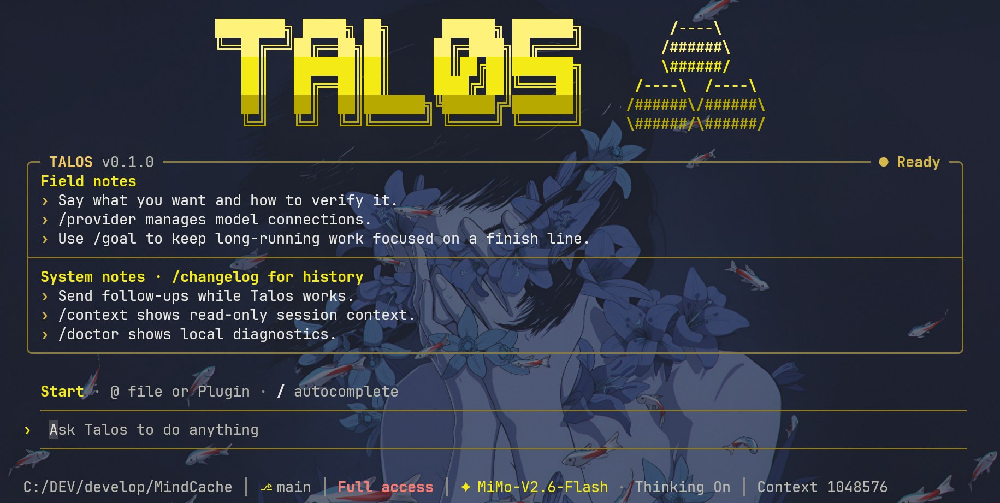
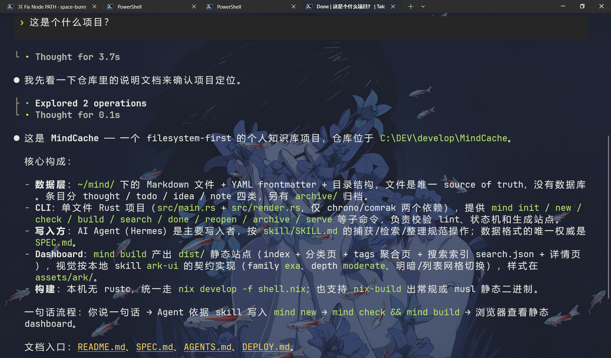

# Talos

**在终端里与代码协作。连接你选择的模型，在自己的项目中开始工作。**

[English](README.md) · [安装](#安装) · [快速开始](#快速开始) · [npm](https://www.npmjs.com/package/@pakiknowledge/tal0s-code)



Talos 是一个终端 coding agent，支持通过对话理解代码、编辑文件和运行命令。Endfield 风格的界面将回复、工具活动和审批请求呈现在工作过程中。你可以选择供应商预设，也可以连接自己的兼容接口。

## 安装

需要 Node.js **22.19–22.x、24.2–24.x、25.x 或 26.x**。

```sh
npm install -g @pakiknowledge/tal0s-code@latest --registry=https://registry.npmjs.org/ --ignore-scripts=false --include=optional
```

原生依赖需要运行安装脚本，请保留可选依赖。

## 快速开始

在你想处理的项目目录打开终端：

```sh
cd /path/to/your/project
talos
```

1. 输入 `/provider` 配置模型连接。选择预设，或填写自己的接口地址、模型名称和 API key。
2. 描述任务与期望结果，例如：“说明这个项目的启动过程，并找出涉及的文件。”
3. 查看回复与工具活动，在出现审批请求时作出选择。

模型调用费用由你选择的供应商收取。



*截图中的背景图与透明效果来自终端设置。*

## 继续工作

| 命令 | 用途 |
| --- | --- |
| `talos "解释这个项目"` | 携带初始任务启动。 |
| `talos --continue` | 继续当前工作目录的最近会话。 |
| `talos --session` | 选择会话。 |
| `talos exec "解释这个项目"` | 无交互界面执行任务。 |
| `talos acp` | 连接 Agent Client Protocol 客户端。 |
| `talos --help` | 查看命令行选项。 |

在 Talos 内，使用 `/provider` 管理模型连接、`/sessions` 查看历史、`/help` 查看命令和快捷键。

## 数据存储

配置和会话默认保存在 `~/.talos`，Windows 对应 `%USERPROFILE%\.talos`。卸载 npm 包会保留这个目录。

## 更新

运行 `talos update` 或在界面中输入 `/update` 检查新版。Talos 会显示升级命令，由你手动安装。再次执行上面的 npm 安装命令即可升级。

## 发行状态

Talos **0.1.0** 是 CLI 预览版。Windows x64 安装及现有发行检查已通过；NixOS 测试仍待完成，跨平台验证尚未齐备。

桌面 GUI 单独开发，本版不包含默认联网搜索。

遇到问题时，可以[提交 issue](https://github.com/PAKIKNOWLEDGE/Talos-Code-CLI/issues)，附上系统、Node.js 版本、Talos 版本和错误信息。分享日志前请移除 API key 及私人项目内容。

## 从源码运行

```sh
pnpm install --frozen-lockfile
pnpm build
pnpm start
```

开发与检查约定见 [CONTRIBUTING.md](CONTRIBUTING.md)，fork 维护方式见[源码同步说明](docs/source-sync.md)。

## 许可与致谢

Talos 基于 [MiniMax Code](https://github.com/MiniMax-AI/minimax-code)、[pi-mono](https://github.com/badlogic/pi-mono) 等开源项目的工作构建。原作者版权与许可声明保留在 [LICENSE](LICENSE)、[NOTICE](NOTICE)、[THIRD_PARTY_NOTICES.md](THIRD_PARTY_NOTICES.md) 和 [LEGAL.md](LEGAL.md) 中。
